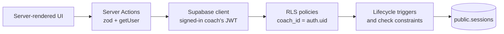

# Coachdesk

A coaching-session app built for the SKILD technical task. Coaches sign up, sign in, and create, view, edit and cancel their own sessions. Data lives in Supabase (PostgreSQL).

**In short:** the database itself decides who can see what. Every request runs as the signed-in coach, and PostgreSQL Row Level Security returns or changes only that coach's rows. Even a hand-crafted API request can't reach another coach's sessions. An automated test suite runs the real migrations against Postgres and checks this on every push.

[](https://github.com/hahnalai8n1/skild-coaching-bookings/actions/workflows/ci.yml)

## Requirements checklist

| Requirement | Where it lives | How it is verified |
| --- | --- | --- |
| Coach can sign up and log in | `app/(auth)`, `app/actions/auth.ts`, `app/auth/callback` | Manual; zod validation on the server |
| Coach can create a session | `app/sessions/new`, `createSessionAction` | `supabase/tests/rls.test.ts` (owner assigned by DB) |
| Coach can view their own sessions | `app/dashboard/page.tsx` | RLS tests: *only returns a coach's own sessions* |
| Coach can edit or cancel a session | `app/sessions/[id]/edit`, `updateSessionAction`, `cancelSessionAction` | RLS and lifecycle tests |
| Data stored in Supabase/PostgreSQL | `supabase/migrations/` | Migrations applied by the test suite |
| RLS isolates coaches | `202609250001_create_sessions.sql`, `202609250002_harden_session_lifecycle.sql` | 9 isolation tests, plus `npm run test:rls` against a live project |
| Loading and error states | `loading.tsx`, `error.tsx`, `not-found.tsx`, form and button pending states | Manual |

## Approach

- **Stack:** Next.js 15 App Router, React 19, TypeScript (strict), Supabase via `@supabase/ssr`, Tailwind CSS, zod, Vitest.
- **Reads** happen in Server Components. **Writes** go through Server Actions, which validate input with zod and re-check the user with `supabase.auth.getUser()`. That call verifies the token with Supabase instead of trusting the cookie.
- **The browser only ever holds the public anon key.** No service-role key is used by the app.
- **RLS is the security boundary.** Queries also filter by `coach_id` to make the intent readable, but the tests show that removing that filter would not leak data.
- **Business rules that must always hold are enforced in the database**, not only in the UI: valid time ranges, no hard deletes, cancellation is final.



## Database structure

One table, `public.sessions`:

| Column | Type | Notes |
| --- | --- | --- |
| `id` | `uuid` | Primary key |
| `coach_id` | `uuid` | Owner. Defaults to `auth.uid()`, references `auth.users`, can never change |
| `title` | `text` | 2–80 characters |
| `starts_at`, `ends_at` | `timestamptz` | Stored as UTC; `ends_at > starts_at` |
| `location` | `text` | Optional, ≤ 120 characters |
| `notes` | `text` | Optional, ≤ 1000 characters |
| `status` | `text` | `scheduled` or `cancelled` |
| `cancelled_at` | `timestamptz` | Set by the database when cancelled; must match `status` |
| `created_at`, `updated_at` | `timestamptz` | Maintained by triggers |

Index: `(coach_id, starts_at)`, which matches the dashboard query.

## RLS and security setup

RLS is enabled on `public.sessions`. All policies apply to the `authenticated` role and compare `coach_id` with `auth.uid()`:

| Operation | Policy | Effect |
| --- | --- | --- |
| `SELECT` | `using (auth.uid() = coach_id)` | Other coaches' rows are invisible, even when queried by id |
| `INSERT` | `with check (auth.uid() = coach_id)` | A coach cannot create a session in someone else's name |
| `UPDATE` | `using` + `with check` on the same condition | A coach can't edit another coach's row or hand their own row to someone else |
| `DELETE` | *no policy, privilege revoked* | Sessions are never hard-deleted; cancellation keeps history |

Beyond the policies:

- `anon` (signed-out) has **no privileges** on the table, so signed-out requests fail before RLS is even consulted.
- Lifecycle triggers (`202609250002`) reject changes to `coach_id` or `created_at`, any change to a cancelled session, and cancelling a session that has already finished. They set `cancelled_at` and force new rows to start as `scheduled`.
- Trigger functions are `security invoker` with an empty `search_path`, so they run with the caller's permissions and can't be hijacked through the search path.
- A missing session and another coach's session return the same "not found" page, so the app never confirms that someone else's id exists.

## Verification

```bash
npm run lint
npm run typecheck
npm test          # unit tests + database RLS suite
npm run build
```

CI runs all four on every push.

### Database RLS suite (no Supabase project needed)

`supabase/tests/rls.test.ts` starts an in-process PostgreSQL ([PGlite](https://pglite.dev)) and sets up the parts of Supabase that RLS relies on: the `anon` and `authenticated` roles, Supabase's default grants to those roles, and `auth.uid()`. It then applies the migrations from `supabase/migrations/` unchanged and makes requests as each role:

```
✓ coach isolation (RLS) > assigns the signed-in coach as owner by default
✓ coach isolation (RLS) > only returns a coach's own sessions
✓ coach isolation (RLS) > hides another coach's session even when queried by id
✓ coach isolation (RLS) > prevents editing another coach's session
✓ coach isolation (RLS) > prevents cancelling another coach's session
✓ coach isolation (RLS) > prevents creating a session on behalf of another coach
✓ coach isolation (RLS) > prevents transferring a session to another coach
✓ coach isolation (RLS) > does not allow anyone to hard-delete sessions
✓ coach isolation (RLS) > denies signed-out visitors any access
✓ session lifecycle rules > records when a session is cancelled
✓ session lifecycle rules > treats cancellation as final
✓ session lifecycle rules > does not allow cancelling a session that has already finished
✓ session lifecycle rules > always creates sessions as scheduled
✓ session lifecycle rules > rejects a session that ends before it starts

Tests  14 passed (14)
```

To check that these tests can actually fail, I added a temporary migration that disabled RLS and restored table grants. All 7 access-control tests then failed. The suite also caught a real bug: the first migration used `default (select auth.uid())`, which PostgreSQL rejects because a column default can't contain a subquery.

### Against a real Supabase project (optional)

`npm run test:rls` runs the same checks over the Supabase HTTP API. It creates two temporary confirmed users, signs each one in with the public anon key, runs the checks, and deletes the users afterwards. It needs `SUPABASE_SERVICE_ROLE_KEY` in the shell, used only to create and delete those test users. Never commit that key or expose it to the browser.

## Local setup

1. **Create a free Supabase project.** In **SQL Editor**, run the migrations in order:
   - `supabase/migrations/202609250001_create_sessions.sql`
   - `supabase/migrations/202609250002_harden_session_lifecycle.sql`

   Or, with the Supabase CLI linked to the project: `supabase db push`.
2. **Auth redirect.** In **Authentication → URL Configuration**, add `http://localhost:3000/auth/callback`, plus the HTTPS equivalent for a deployed URL.
3. **Environment.**
   ```bash
   cp .env.example .env.local   # then set the project URL and anon/publishable key
   ```
4. **Run.**
   ```bash
   npm install
   npm run dev
   ```

## Product decisions and assumptions

- **One coach owns a session.** Clubs, athlete bookings, recurring sessions and payments are out of scope.
- **Cancel, don't delete.** A cancelled session stays in the coach's history with a `cancelled_at` time. That record matters for attendance, refunds and cancellation policies later, so the database doesn't allow hard deletes at all.
- **Cancellation is final.** To reinstate a session, the coach creates a new one. This keeps an honest audit trail and avoids ambiguous state once payments are attached.
- **Finished sessions can't be cancelled**, but they can still be edited, for example to add notes after the session.
- **Timezones.** Times are entered in the coach's local time, converted to UTC in the browser, and stored as `timestamptz`. They are formatted only in the browser, because the server (UTC on Vercel) doesn't know the viewer's timezone. Server-rendered times would show UTC to an Australian coach.
- **Dashboard grouping.** "Upcoming" includes sessions in progress, soonest first. "Past & cancelled" shows the most recent first.
- **Email confirmation follows the Supabase project setting.** If it is on, sign-up shows a check-your-email screen; otherwise the coach goes straight to the dashboard.

## If this moved into the SKILD product

1. **Tenancy first.** Add `businesses` and `business_members (business_id, user_id, role)`, and give sessions a `business_id`. Policies would check membership through a `security definer` helper function such as `is_member(business_id)`, so the lookup doesn't recurse through RLS. Admins would see every coach's sessions in their business; coaches would see only their own. This comes before payments or member bookings, because those depend on tenant isolation.
2. **Scheduling integrity.** Add an exclusion constraint on `(coach_id, tstzrange(starts_at, ends_at))` to stop double-booking, plus recurrence rules.
3. **Cancellation policies and money.** Cancellation windows, refunds and credits, with Stripe calls made idempotent and reconciled by webhook.
4. **Tests move with it.** Every new policy gets a case in the database suite before it ships.
