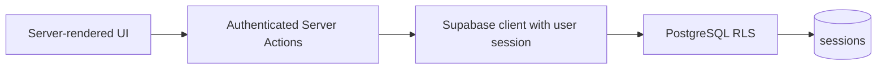

# Coachdesk

Coachdesk is a focused coaching-session workspace built for the SKILD technical task. Coaches can create an account, sign in, create and manage sessions, and cancel sessions without losing their history. PostgreSQL Row Level Security is the primary security boundary: even a modified browser request cannot read or change another coach's records.

## Live product scope

- Coach email/password sign-up and sign-in
- Protected dashboard containing only the signed-in coach's sessions
- Create and edit session details
- Soft cancellation that preserves operational history
- Local-time input and display, with UTC storage
- Responsive UI with loading, empty, success and error states
- Database constraints and RLS policies delivered as a repeatable migration
- Unit tests for session validation
- Two-user integration test that proves database-level isolation

## Technical approach

The application uses Next.js App Router, TypeScript strict mode, React Server Components, Server Actions, Tailwind CSS and Supabase.



Reads happen directly in Server Components. Mutations use Server Actions and authenticate the user again at the server boundary. Application queries include an explicit owner filter for defence in depth, but privacy does not depend on it: RLS independently restricts every SELECT, INSERT, UPDATE and DELETE.

## Database structure

The migration at `supabase/migrations/202609250001_create_sessions.sql` creates one table:

| Column | Purpose |
| --- | --- |
| `id` | UUID primary key |
| `coach_id` | Owner; defaults to `auth.uid()` and references `auth.users` |
| `title` | Required session name, constrained to 2–80 characters |
| `starts_at`, `ends_at` | `timestamptz` values stored as UTC |
| `location`, `notes` | Optional operational details |
| `status` | `scheduled` or `cancelled` |
| `created_at`, `updated_at` | Audit timestamps; `updated_at` is trigger-maintained |

Database constraints reject invalid time ranges and oversized content even if validation is bypassed in the browser.

## RLS and security

RLS is enabled on `public.sessions`. Each policy compares `coach_id` with `auth.uid()`:

- `SELECT ... USING` hides sessions owned by other coaches.
- `INSERT ... WITH CHECK` prevents forged ownership.
- `UPDATE ... USING / WITH CHECK` prevents both modifying another coach's row and transferring ownership.
- `DELETE ... USING` completes the access model, although the product uses soft cancellation.

The application never uses or exposes a service-role key. The optional integration test uses that key only in a local Node process to create and clean up temporary test users.

## Local setup

### 1. Create a Supabase project

Create a free project, then open **SQL Editor** and run:

```text
supabase/migrations/202609250001_create_sessions.sql
```

Alternatively, with the Supabase CLI linked to the project:

```bash
supabase db push
```

In **Authentication → URL Configuration**, add `http://localhost:3000/auth/callback` as a redirect URL. For a deployed review app, add its equivalent HTTPS URL too.

### 2. Configure environment variables

```bash
cp .env.example .env.local
```

Set the project URL and anon key from **Project Settings → API**:

```env
NEXT_PUBLIC_SUPABASE_URL=https://your-project.supabase.co
NEXT_PUBLIC_SUPABASE_ANON_KEY=your-anon-key
```

`SUPABASE_SERVICE_ROLE_KEY` is not required to run the app. Add it only when running the local RLS verification script; never prefix it with `NEXT_PUBLIC_` or add it to Vercel's client-side environment.

### 3. Run the application

```bash
npm install
npm run dev
```

Open `http://localhost:3000`, create two coach accounts and confirm each email if email confirmation is enabled.

## Verification

Run static and unit checks:

```bash
npm run typecheck
npm test
npm run build
```

To prove RLS with two temporary authenticated users, add the service-role key to your shell and run:

```bash
npm run test:rls
```

The test verifies that Coach B cannot read or update Coach A's session and cannot create a row that claims Coach A's identity. Temporary users and their cascade-owned sessions are removed at the end.

## Product decisions and assumptions

- **Cancellation preserves history.** A cancelled session remains visible rather than being deleted. This supports future attendance, payment and refund workflows.
- **Times are portable.** The browser converts local inputs to UTC before submission; `timestamptz` keeps the instant unambiguous, and each viewer sees their own local timezone.
- **One coach owns one session.** Club administrators, athlete bookings, recurrence and payments are intentionally outside this exercise.
- **Email confirmation follows project settings.** If enabled, sign-up leads to a check-your-email screen; otherwise the authenticated coach enters the dashboard immediately.
- **Security errors are deliberately non-specific.** An inaccessible session and a missing session share the same not-found response, avoiding ownership disclosure.

## If this moved into the SKILD product

The next step would be introducing a `businesses` table plus membership roles, then scoping sessions to both the business and coach. That migration should precede payments or member booking because tenant isolation is the foundation those workflows rely on. Recurrence, cancellation-policy enforcement and Stripe-side idempotency would follow as separate, tested changes.
